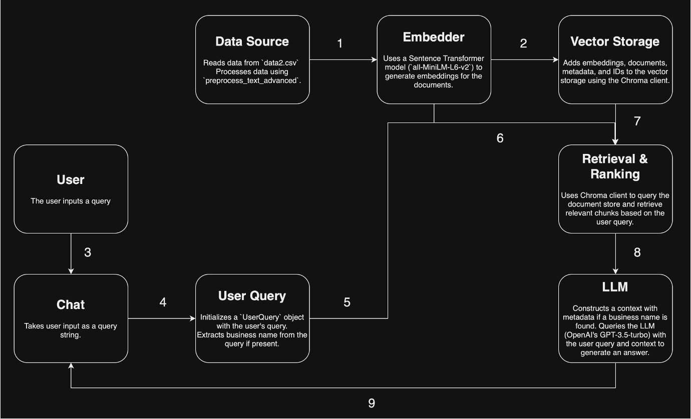

# Gen_AI

## Author
- Erwin Minor - 214601

## Table of Contents
- [Objective](#objective)
- [Description](#description)
- [Data](#data)
- [Diagram](#diagram)
- [Repository Structure](#repository-structure)
- [Instructions for Use](#instructions-for-use)

## Objective
To create a Yelp Chatbot using a Retrieval-Augmented Generation (RAG) model to assist customers in easily obtaining information about businesses in the USA.

## Description
The chatbot allows users to ask for the address, schedule, reviews, tips, categories, or ratings of a business, simplifying the process of finding this information without having to search across different sites or read through numerous reviews. This RAG implementation utilizes the Chroma Client.

## Data
The data is available at the following [link](https://www.yelp.com/dataset).

## Diagram


## Repository Structure

```
│
├── README.md
├── code
│   ├── Preprocess data.ipynb
│   └── RAG-Chroma.ipynb
├── data
│   └── data.md
├── images
│   └── Diagram.png
└── pres
    └── presentation.pdf
```

## Instructions for Use
To run the chatbot, follow these steps:
1. Download the data from Yelp using this [link](https://www.yelp.com/dataset).
2. Save the files in the appropriate directory.
3. Run `Preprocess data.ipynb` to preprocess the data.
4. Run `RAG-Chroma.ipynb` to start the chatbot.
